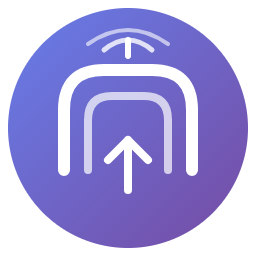

# OpenTunnel

<p align="center">
  
</p>

<p align="center">
  <strong>Expose Localhost Without Lock-In</strong>
</p>

<p align="center">
  
  
  
</p>

<p align="center">
  <a href="#features">Features</a> •
  <a href="#installation">Installation</a> •
  <a href="#usage">Usage</a> •
  <a href="#self-hosting">Self-Hosting</a> •
  <a href="#contributing">Contributing</a> •
  <a href="#philosophy">Philosophy</a>
</p>

---

**OpenTunnel** is a free and open-source VS Code extension that turns your local development server into a temporary public URL — instantly.

- ✅ No accounts
- ✅ No artificial limits
- ✅ No tracking
- ✅ Works from **any device on the internet**

As long as your system is online and the extension is running, your local app is accessible from any device via a public URL.

## Features

| Feature | Description |
|---------|-------------|
| 🖱️ **One-click localhost exposure** | Start a tunnel directly from VS Code |
| 🌍 **Publicly accessible URLs** | Share with anyone, anywhere on the internet |
| 🔍 **Auto-detects running servers** | Finds your dev servers automatically — no manual port entry |
| 🆓 **No signup or API keys** | Just install and use |
| ⏱️ **Temporary URLs per session** | URLs are generated fresh each time |
| 🌐 **Works with any framework** | React, Node, Django, Flask, Rails, PHP... |
| 🏠 **Self-hostable relay server** | Run your own infrastructure |
| 📱 **Works on mobile** | Test on phones, tablets, any device |

## Installation

### From VS Code Marketplace

1. Open VS Code
2. Go to Extensions (`Ctrl+Shift+X` / `Cmd+Shift+X`)
3. Search for "OpenTunnel"
4. Click Install

### From VSIX

```bash
# Download the latest .vsix from releases
code --install-extension opentunnel-1.0.0.vsix
```

### From Source

```bash
git clone https://github.com/opentunnel/opentunnel-vscode
cd opentunnel-vscode
npm install
npm run compile
# Press F5 in VS Code to launch Extension Development Host
```

## Usage

### Starting a Tunnel

1. **Command Palette**: Press `Ctrl+Shift+P` / `Cmd+Shift+P` and type "OpenTunnel: Start Tunnel"
2. **Status Bar**: Click the "OpenTunnel" item in the status bar
3. **Activity Bar**: Click the OpenTunnel icon and use the "Start Tunnel" button

Enter the local port your dev server is running on (e.g., 3000, 8080, 5000).

### Managing Tunnels

- **Copy URL**: Click the status bar item or use "OpenTunnel: Copy URL"
- **Stop Tunnel**: Use the command palette or click the stop button in the sidebar
- **View Dashboard**: "OpenTunnel: Show Dashboard" for a full overview

### Configuration

Open VS Code Settings and search for "OpenTunnel":

| Setting | Default | Description |
|---------|---------|-------------|
| `opentunnel.relayServer` | `ws://localhost:8080/tunnel` | Relay server URL. Change to `wss://your-server.com/tunnel` for public access |
| `opentunnel.defaultPort` | `3000` | Default port (auto-detect overrides this) |
| `opentunnel.autoReconnect` | `true` | Auto-reconnect on disconnect |
| `opentunnel.showNotifications` | `true` | Show notification on tunnel start |
| `opentunnel.subdomain` | `` | Request specific slug (e.g. `my-app` → `/t/my-app`) |

## Self-Hosting

The relay server is what makes your tunnel accessible. You have three modes:

### 🏠 Mode 1: Local Network Only (LAN/WiFi)

Good for testing on phones or other devices on the **same WiFi**:

```bash
cd relay-server
npm install
npm run build
npm start
```

URLs will be like `http://192.168.1.42:8080/t/swift-cloud-123` — only reachable from your local network.

### 🌍 Mode 2: Public Internet (Free Cloud Deploy)

To make tunnels accessible to **anyone on the internet**, deploy the relay server to a free cloud platform:

#### Option A: Render (recommended — easiest)

1. Push this repo to GitHub
2. Go to [render.com](https://render.com) → **New +** → **Blueprint**
3. Connect your GitHub repo — Render reads the `render.yaml` automatically
4. Click **Deploy** → you'll get a URL like `https://opentunnel-relay.onrender.com`
5. In VS Code settings, set:
   ```json
   "opentunnel.relayServer": "wss://opentunnel-relay.onrender.com/tunnel"
   ```

#### Option B: Railway

1. Go to [railway.app](https://railway.app) → **New Project** → **Deploy from GitHub**
2. Select your repo → Railway reads `railway.json`
3. Set the env var `PUBLIC_URL` to your Railway URL (e.g. `https://opentunnel-relay.up.railway.app`)
4. In VS Code settings, set:
   ```json
   "opentunnel.relayServer": "wss://opentunnel-relay.up.railway.app/tunnel"
   ```

#### Option C: Fly.io

```bash
cd relay-server
fly launch --name opentunnel-relay
fly deploy
```

Then set:
```json
"opentunnel.relayServer": "wss://opentunnel-relay.fly.dev/tunnel"
```

#### Option D: Any VPS / Docker Host

```bash
cd relay-server
docker build -t opentunnel-relay .
docker run -d -p 8080:8080 -e PUBLIC_URL=https://yourdomain.com opentunnel-relay
```

### 🔧 Environment Variables

| Variable | Default | Description |
|----------|---------|-------------|
| `PORT` | `8080` | HTTP port (cloud platforms set this automatically) |
| `PUBLIC_URL` | _(auto-detect)_ | Full public URL, e.g. `https://relay.example.com` |
| `MAX_TUNNELS` | `1000` | Maximum simultaneous tunnels |
| `REQUEST_TIMEOUT` | `30000` | Request timeout in ms |
| `USE_HTTPS` | `false` | Enable built-in HTTPS (not needed behind cloud proxy) |
| `SSL_CERT` / `SSL_KEY` | | Paths to SSL certificate files |

Then configure the extension:
```json
{
  "opentunnel.relayServer": "wss://your-server.com/tunnel"
}
```

## How It Works

```
┌─────────────────┐       ┌──────────────────┐       ┌─────────────────┐
│   Your Browser  │ ───▶  │   Relay Server   │ ◀──── │  VS Code Ext.   │
│  (any device)   │       │  (public HTTPS)  │       │ (WebSocket)     │
└─────────────────┘       └──────────────────┘       └─────────────────┘
                                   │                         │
                                   │                         │
                                   └─────────────────────────┘
                                              │
                                              ▼
                                   ┌─────────────────┐
                                   │  localhost:3000 │
                                   │  (your app)     │
                                   └─────────────────┘
```

1. VS Code extension connects to relay server via WebSocket
2. Relay server assigns a unique public URL (e.g., `https://your-relay.onrender.com/t/swift-cloud-123`)
3. HTTP requests to that URL are forwarded through the WebSocket
4. Extension proxies requests to your local server
5. Responses flow back the same way

## Philosophy

> Developers should not need to create accounts or accept hidden limits just to share their work.

OpenTunnel is built on:

- **Transparency**: Open source, no hidden code or tracking
- **Simplicity**: One click to share your work
- **Freedom**: No accounts, no limits, self-host if you want
- **Community**: Built for developers, by developers

## Comparison

| Feature | OpenTunnel | ngrok (free) | localtunnel |
|---------|------------|--------------|-------------|
| No account needed | ✅ | ❌ | ✅ |
| Open source | ✅ | ❌ | ✅ |
| Self-hostable | ✅ | ❌ | ✅ |
| VS Code integration | ✅ | ❌ | ❌ |
| No bandwidth limits | ✅ | ❌ | ✅ |
| Custom subdomains | ✅ | 💰 Paid | ✅ |

## Commands

| Command | Description |
|---------|-------------|
| `OpenTunnel: Start Tunnel` | Start a new tunnel |
| `OpenTunnel: Stop Tunnel` | Stop an active tunnel |
| `OpenTunnel: Copy URL` | Copy tunnel URL to clipboard |
| `OpenTunnel: Open in Browser` | Open tunnel URL in browser |
| `OpenTunnel: Show Status` | Show current tunnel status |
| `OpenTunnel: Show Dashboard` | Open the dashboard webview |

## Security

- **Local traffic only**: Your local server is proxied but never stored
- **Temporary URLs**: Tunnel URLs are generated fresh each session
- **No data logging**: The relay server doesn't log request contents
- **Open source**: You can audit the entire codebase
- **Self-hostable**: Run your own relay for complete control

**Note**: Only expose development servers, never production databases or sensitive services.

## Troubleshooting

### "Connection refused" error
Make sure your local development server is running on the specified port.

### Tunnel disconnects frequently
Check your internet connection. Enable `opentunnel.autoReconnect` in settings.

### Custom subdomain not available
The requested subdomain might already be in use. Try a different one or leave blank for random.

### Self-hosted server not working
Ensure WebSocket connections are allowed through your firewall and reverse proxy.

## Contributing

We welcome contributions! 🎉

### Quick Start
```bash
git clone https://github.com/YOUR-USERNAME/opentunnel
cd opentunnel
npm install
npm run compile
# Press F5 in VS Code to launch Extension Development Host
```

### Development Setup
- **Extension**: TypeScript, VS Code API
- **Relay Server**: Node.js, WebSocket, TypeScript
- **Build**: `npm run compile` (extension), `npm run build` (relay)

### Contributing Ideas
- 🌍 Additional cloud platform configs (Heroku, DigitalOcean, etc.)
- 🔍 More dev server auto-detection (Nuxt, SvelteKit, etc.)
- 📱 Mobile-specific optimizations
- 🎨 UI/UX improvements
- 📚 Documentation & tutorials
- 🌐 Internationalization

See [CONTRIBUTING.md](CONTRIBUTING.md) for detailed guidelines.

## License

MIT License - See [LICENSE](LICENSE) file.

---

<p align="center">
  Made with ❤️ by the open source community
</p>

<p align="center">
  <strong>⭐ Star this repo if you find it helpful!</strong>
</p>

<p align="center">
  Questions? Issues? <a href="https://github.com/YOUR-USERNAME/opentunnel/issues">Open an issue</a> or start a <a href="https://github.com/YOUR-USERNAME/opentunnel/discussions">discussion</a>
</p>
